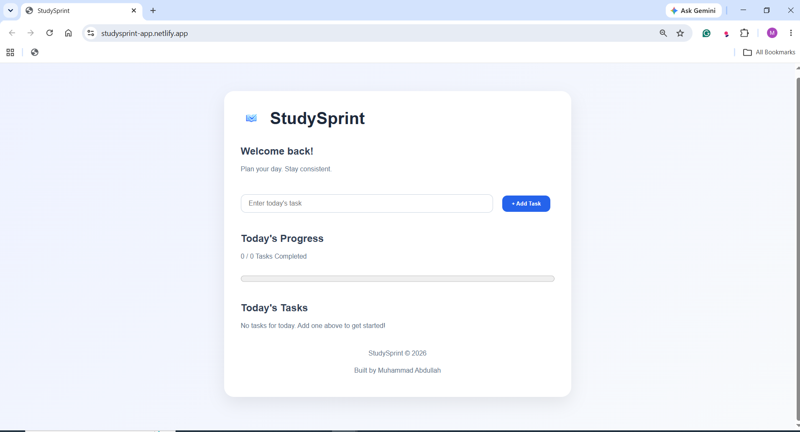
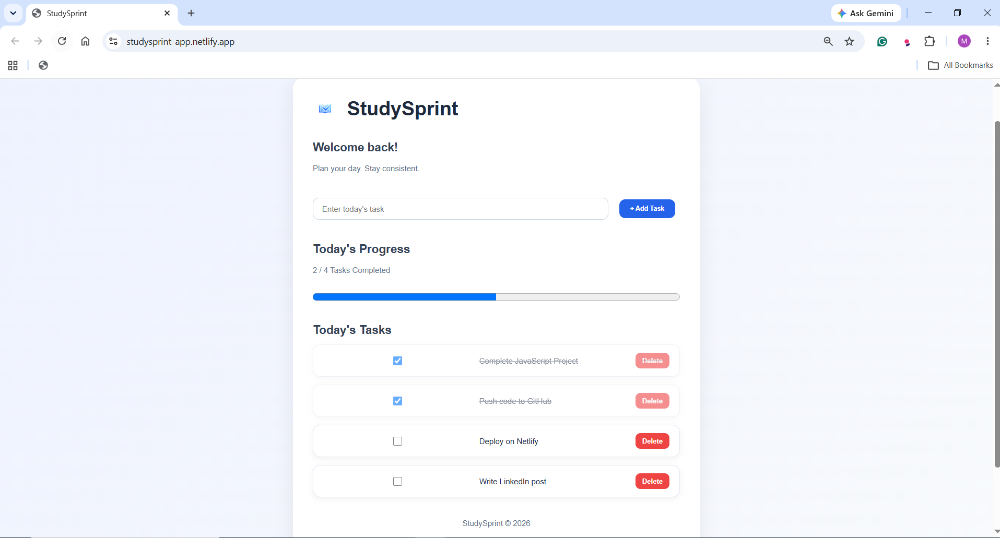

# 📚 StudySprint

A responsive task management web application built with **HTML, CSS, and Vanilla JavaScript** to practice DOM manipulation, Local Storage, and modern frontend development fundamentals.

🌐 **Live Demo:** https://studysprint-app.netlify.app/

💻 **Source Code:** https://github.com/abdullahcodes-dev/StudySprint

---

## 📸 Preview

### Home Screen



### Tasks in Action



---

## ✨ Features

- ➕ Add new tasks
- ✅ Mark tasks as completed
- 🗑️ Delete tasks
- 📊 Live progress tracking
- 💾 Local Storage persistence
- ⌨️ Add tasks by pressing Enter
- 🚀 Friendly empty state when no tasks exist
- 📱 Clean and intuitive interface

---

## 🛠️ Tech Stack

- HTML5
- CSS3
- Vanilla JavaScript
- Local Storage API
- Git & GitHub
- Netlify

---

## 📂 Project Structure

```text
StudySprint/
│
├── assets/
│   └── images/
│       ├── logo.png
│       ├── screenshot-home.png
│       └── screenshot-tasks.png
│
├── index.html
├── style.css
├── script.js
├── README.md
└── .gitignore
```

---

## 🚀 Getting Started

1. Clone the repository

```bash
git clone https://github.com/abdullahcodes-dev/StudySprint.git
```

2. Open the project folder.

3. Open `index.html` in your browser.

No additional setup or dependencies are required.

---

## 📚 What I Learned

Building **StudySprint** helped me strengthen my understanding of:

- DOM Manipulation
- JavaScript Event Handling
- Functions and Code Organization
- Arrays & Objects
- Local Storage
- Dynamic UI Updates
- Git & GitHub Workflow
- Deploying a static website using Netlify

---

## 🚀 Future Improvements

- ✏️ Edit existing tasks
- 🌙 Dark mode
- 🗂️ Task categories
- 📅 Due dates
- 🔍 Search and filtering
- ↕️ Drag-and-drop task ordering

---

## 👨‍💻 Author

**Muhammad Abdullah**

BSCS Student | Aspiring AI & Software Engineer

GitHub: https://github.com/abdullahcodes-dev

---

If you have suggestions or feedback, feel free to open an issue or submit a pull request.
